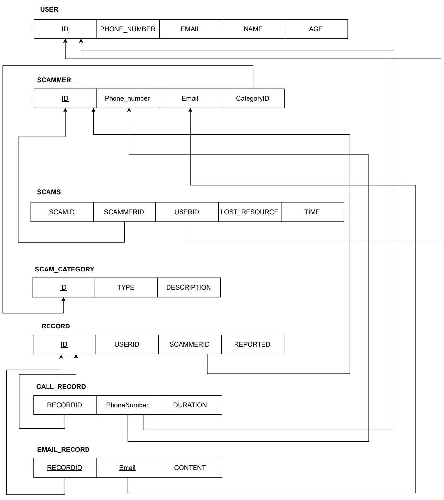

### API for Scam Detection System ###

API Documentation:


List of tables:
API: http://localhost:8081/table/all

Response:

["call_record","email_record","record","scam_category","scammer","scams","user"]

Type:
GET

Get call record Details: 
API: http://localhost:8081/callrecord/all 
```
Response:
    {
        "id": {
            "recordId": 1,
            "phoneNumber": "+123456789"
        },
        "duration": "2023-01-01T14:30:00.000+00:00",
        "record": {
            "recordId": 1,
            "user": {
                "userId": 101,
                "phoneNumber": "+111111111",
                "email": "user101@example.com",
                "name": "John Doe",
                "age": 25
            },
            "scammer": {
                "scammerId": 1,
                "phoneNumber": "+111222333",
                "email": "scammer1@example.com",
                "scamCategory": {
                    "categoryId": 1,
                    "type": "Type 1",
                    "description": "Money Scam"
                }
            },
            "reported": "Possible Money Scam"
        }
    }
```

TYPE: GET		

Email Record 

Api : http://localhost:8081/emailrecord/all

Type : GET
```
Response: 
    {
        "id": {
            "recordId": 1,
            "email": "user1@example.com"
        },
        "content": "URGENT: Your account has been compromised. Click here to secure it now!",
        "record": {
            "recordId": 1,
            "user": {
                "userId": 101,
                "phoneNumber": "+111111111",
                "email": "user101@example.com",
                "name": "John Doe",
                "age": 25
            },
            "scammer": {
                "scammerId": 1,
                "phoneNumber": "+111222333",
                "email": "scammer1@example.com",
                "scamCategory": {
                    "categoryId": 1,
                    "type": "Type 1",
                    "description": "Money Scam"
                }
            },
            "reported": "Possible Money Scam"
    }
```
Record

API : http://localhost:8081/record/all

TYPE: GET
```
Response:
    {
        "recordId": 1,
        "user": {
            "userId": 101,
            "phoneNumber": "+111111111",
            "email": "user101@example.com",
            "name": "John Doe",
            "age": 25
        },
        "scammer": {
            "scammerId": 1,
            "phoneNumber": "+111222333",
            "email": "scammer1@example.com",
            "scamCategory": {
                "categoryId": 1,
                "type": "Type 1",
                "description": "Money Scam"
            }
        },
        "reported": "Possible Money Scam"
    }
```
Scam_category

API:http://localhost:8081/scamcategory/all

Type: get
```
Response: 

    {
        "categoryId": 1,
        "type": "Type 1",
        "description": "Money Scam"
    }
```
Scammer 

API: http://localhost:8081/scammer/all

Type: GET
```
Response:
    {
        "scammerId": 1,
        "phoneNumber": "+111222333",
        "email": "scammer1@example.com",
        "scamCategory": {
            "categoryId": 1,
            "type": "Type 1",
            "description": "Money Scam"
        }
    }
```


Scams:

API: http://localhost:8081/scam/all
```
Response:
    {
        "scamId": 1,
        "scammer": {
            "scammerId": 1,
            "phoneNumber": "+111222333",
            "email": "scammer1@example.com",
            "scamCategory": {
                "categoryId": 1,
                "type": "Type 1",
                "description": "Money Scam"
            }
    }
```
Type: GET

User

API:http://localhost:8081/user/all
```
Respose:
    {
    "userId": 101,
    "phoneNumber": "+111111111",
    "email": "user101@example.com",
    "name": "John Doe",
    "age": 25
    }
```
Type: Get


2) Add new data: your app allows users to enter data that would result in adding new tuples in your tables. In particular, you should demonstrate that your app can get data from the user that would result in adding rows in two (or more) tables. An example of this situation is when we add data about a new employee and their dependents: tuples are added to both the employee and the dependent tables. In case any integrity constraints are violated with the given data values, the app should provide an appropriate message


API: http://localhost:8081/scam/save
```
Request : 
{
  "record": {
    "user": {
      "phoneNumber": "123456789",
      "email": "sudeep@gmail.com",
      "name": "Vicky",
      "age": 75
    },
    "scammer": {
      "phoneNumber": "987654321",
      "email": "xyz@scammer.com",
      "scamCategory": null
    },
    "reported": "User"
  },
  "type": "financial",
  "content": "This is a sample content",
  "duration": "2023-01-01T12:34:56",
  "lostResource":"money"
}
```

```
Response:
{
    "recordId": 21,
    "user": {
        "userId": 121,
        "phoneNumber": "123456789",
        "email": "sudeep@gmail.com",
        "name": "Vicky",
        "age": 75
    },
    "scammer": {
        "scammerId": 21,
        "phoneNumber": "987654321",
        "email": "xyz@scammer.com",
        "scamCategory": {
            "categoryId": 21,
            "type": "financial",
            "description": "Financial scams"
        }
    },
    "reported": "User"
}
```

Type: POST


3 )
Extract from the Database Desirable Information: The application must demonstrate the goals your database is trying to achieve. Hypothetical examples: a) Assuming tables with expenses over the past few years, compute and report a budget for the total expenditures of the next 3 years, assuming an inflation rate given by the user. b) Assuming tables with types of deliverables (services, products, software) and performance indicators (customer reviews, performance scores) report the N-best or N-worst deliverables, where N is given by the user


We have two API’s:


1 to extract the number of users scammed across age group 
20,40,60 adn 60+

API : http://localhost:8081/scam/age 

GET
```
Response:
[
    {
        "age": "20",
        "scamCount": 1
    },
    {
        "age": "40",
        "scamCount": 21
    },
    {
        "age": "60",
        "scamCount": 1
    },
    {
        "age": "60+",
        "scamCount": 1
    }
]
```

2) given min age and max age it gives the count of email scam and phone scam 

API: http://localhost:8081/scam/scamStats

```
Request body  
{
    "minAge":20,
    "maxAge":40
}
```

```
Response:
{
    "phone": 21,
    "email": 21
}
TYPE: GET

```
### Diagram

